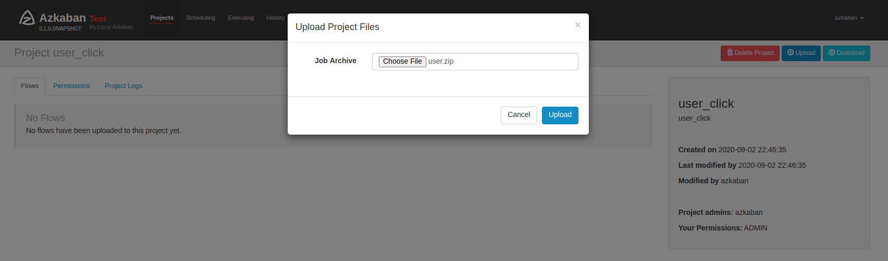
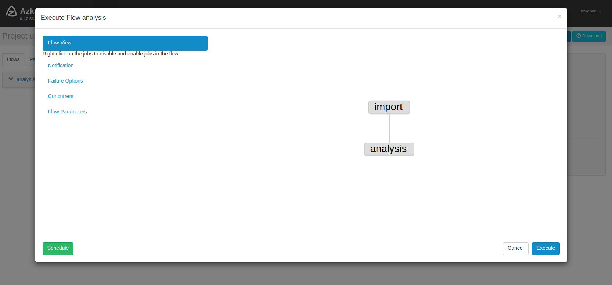
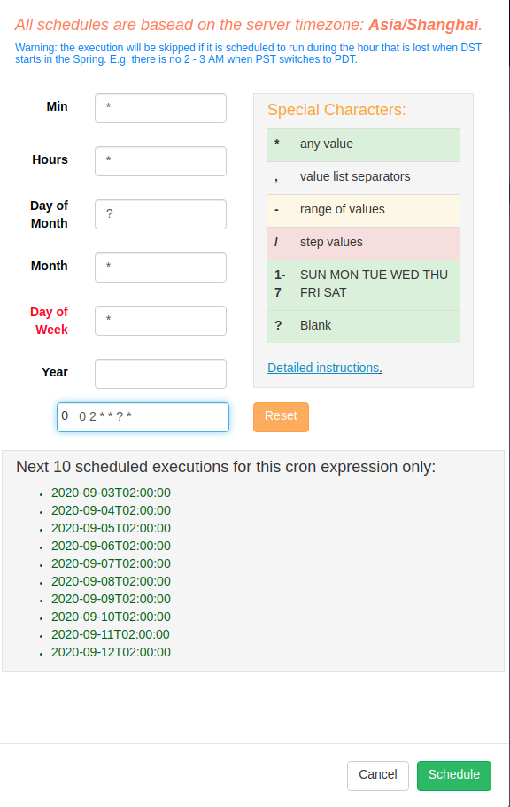
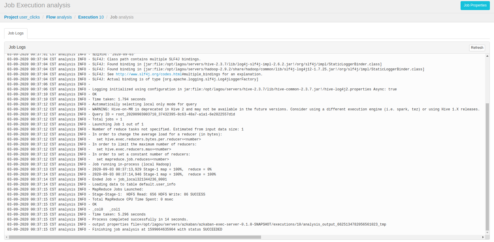
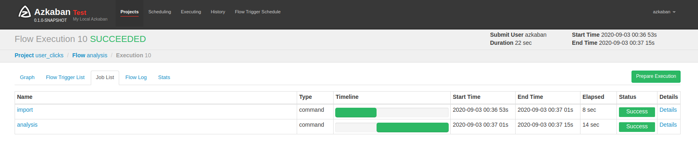

## 一、需求

> 现有用户点击行为数据文件，每天产生会上传到 `hdfs` 目录，按天区分目录。
> 现在需要每天凌晨两点定时导入 `Hive` 表指定分区中，并统计出今日活跃用户数插入指标表中。

1. 日志文件 `clicklog`

> 用户点击行为数据，三个字段是用户 `id`, 点击时间，访问页面

```txt
userId   click_time             index
uid1	2020-06-21	12:10:10	a.html 
uid2	2020-06-21	12:15:10	b.html 
uid1	2020-06-21	13:10:10	c.html 
uid1	2020-06-21	15:10:10	d.html 
uid2	2020-06-21	18:10:10	e.html
```


2. `hdfs` 目录会以日期划分文件，例如：

```shell
/user_clicks/20200621/clicklog.dat
/user_clicks/20200622/clicklog.dat
/user_clicks/20200623/clicklog.dat
...
```

3. 开发需求

- 开发一个 `import.job` 每日从 `hdfs` 对应日期目录下同步数据到该表指定分区。（日期格式同上或者自定义）
- 开发一个 `analysis.job` 依赖 `import.job` 执行，统计出每日活跃用户(一个用户出现多次算作一次)数并插入 `user_info` 表中。


## 二、数据准备

### （1）`Hive` 表

1. 原始数据分区表

```sql
create table user_clicks(id string,click_time string,index string)
partitioned by(dt string) row format delimited fields terminated by '\t' ;

# 导入本地数据
LOAD DATA LOCAL INPATH '/root/data/click.txt' OVERWRITE INTO TABLE user_clicks PARTITION (dt='20200621');
```

2. 指标表

```sql
create table user_info(active_num string,`date` string)
row format delimited fields terminated by '\t' ;
```


3. 数据准备：

> `user_clicks.txt`

```text
uid1	2020-09-02	12:10:10	a.html 
uid2	2020-09-02	12:15:10	b.html 
uid1	2020-09-02	13:10:10	c.html 
uid1	2020-09-02	15:10:10	d.html 
uid2	2020-09-02	18:10:10	e.html
uid3	2020-09-02	12:10:10	a.html 
uid4	2020-09-02	12:15:10	b.html 
uid5	2020-09-02	13:10:10	c.html 
uid6	2020-09-02	15:10:10	d.html 
uid7	2020-09-02	18:10:10	e.html
```


4. 将文件上传到 `HDFS`

```bash
# 在 Hadoop 创建文件夹
hdfs dfs -mkdir -p /user_clicks/20200902/
hdfs dfs -ls /user_clicks/20200902


# 因为测试，今天日期为 20200902
hdfs dfs -put user_clicks.txt /user_clicks/20200902
```


## 三、开发思路

开发思路：

1. 写 `job` 脚本
2. 写 `shell` 脚本
3. 写 `hive sql`
4. 上传至 `azkaban`
5. 调度设置，调度


## 四、开发步骤


> 首先在 `hive` 中，创建表

1. 创建 `import.job`

```bash
type=command
command=sh import.sh
```

创建 `import.sh`，如下

```shell
#!/bin/sh

echo 'import data from hdfs。。。'

currDate=`date +%Y%m%d`

echo "现在时间：'$currDate'"

/opt/lagou/servers/hive-2.3.7/bin/hive -e "USE default;LOAD DATA INPATH '/user_clicks/$currDate/*' OVERWRITE INTO TABLE user_clicks PARTITION (dt='$currDate');"
```

2. 创建 `analysis.job` 

```bash
type=command
dependencies=import
command=sh analysis.sh
```

创建 `analysis.sh`，如下：

```shell
#!/bin/sh

echo 'analysis user click。。。'

currDate=`date +%Y-%m-%d`

echo "现在时间：'$currDate'"

/opt/lagou/servers/hive-2.3.7/bin/hive -e "USE default;INSERT INTO TABLE user_info SELECT COUNT(DISTINCT id) active_num, TO_DATE(click_time) `date` FROM user_clicks WHERE TO_DATE(click_time) = '$currDate' GROUP BY TO_DATE(click_time);"
```

格式化 `sql` ， 如下：

> 只插入当天统计数据

```sql
INSERT INTO TABLE user_info
SELECT COUNT(DISTINCT id), TO_DATE(click_time)
FROM user_clicks
WHERE TO_DATE(click_time) = '$currDate'
GROUP BY TO_DATE(click_time);

# 实例
INSERT INTO TABLE user_info
SELECT COUNT(DISTINCT id), TO_DATE(click_time)
FROM user_clicks
WHERE TO_DATE(click_time) = '2020-09-02'
GROUP BY  TO_DATE(click_time);
```


3. 打包，上传至 `azkaban`

```bash
zip -r user.zip *

drwxrwxr-x 2 donald donald 4096 Sep  3 01:15 ./
drwxrwxr-x 3 donald donald 4096 Sep  2 19:17 ../
-rw-rw-r-- 1 donald donald   55 Sep  2 19:37 analysis.job
-rw-rw-r-- 1 donald donald  276 Sep  3 01:15 analysis.sh
-rw-rw-r-- 1 donald donald   33 Sep  2 19:17 import.job
-rw-rw-r-- 1 donald donald  270 Sep  3 01:15 import.sh
-rw-r--r-- 1 donald donald 1134 Sep  3 01:15 user.zip
```




4. 调度

如图：




5. 定时调度

> 每天两点进行调度

```bash
# cron 表达式如下：
0 0 2 * * ? *
```

如图：




## 五、结果


1. `azkaban` 执行日志如下：



截图如下：




2. `hive` 查询结果

```sql
hive (default)> select * from user_info;
OK
user_info.active_num	user_info.date
7	2020-09-03
Time taken: 0.132 seconds, Fetched: 1 row(s)
hive (default)> select * from user_clicks;
OK
user_clicks.id	user_clicks.click_time	user_clicks.index	user_clicks.dt
uid1	2020-09-03 12:10:10	a.html 	20200903
uid2	2020-09-03 12:15:10	b.html 	20200903
uid1	2020-09-03 13:10:10	c.html 	20200903
uid1	2020-09-03 15:10:10	d.html 	20200903
uid2	2020-09-03 18:10:10	e.html	20200903
uid3	2020-09-03 12:10:10	a.html 	20200903
uid4	2020-09-03 12:15:10	b.html 	20200903
uid5	2020-09-03 13:10:10	c.html 	20200903
uid6	2020-09-03 15:10:10	d.html 	20200903
uid7	2020-09-03 18:10:10	e.html	20200903
Time taken: 0.15 seconds, Fetched: 10 row(s)
```