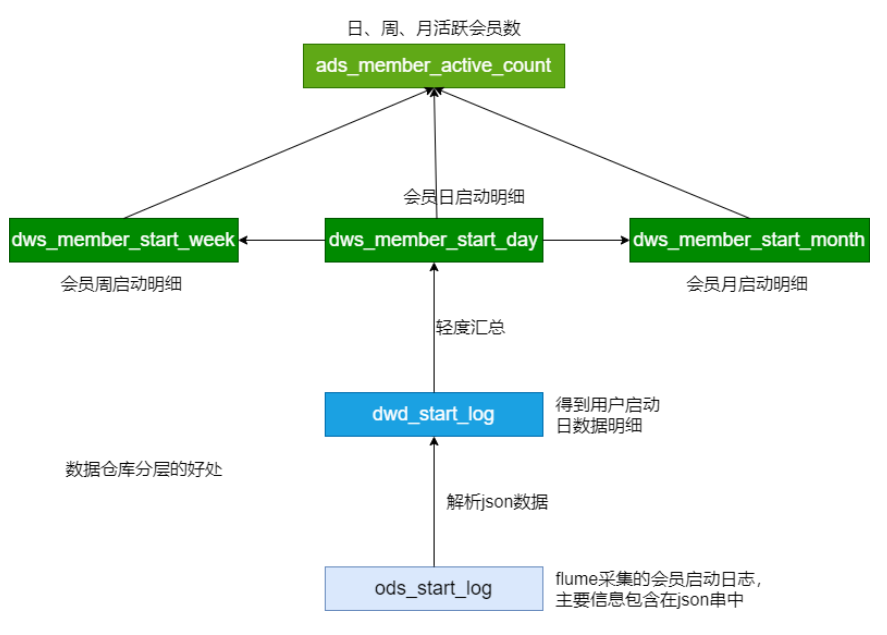

作业：
1. 在会员分析中计算最近七天连续三天活跃会员数。
2. 项目的数据采集过程中，有哪些地方能够优化，如何实现？


## 一、最近七天连续三天活跃会员数




需求：在会员分析中计算最近七天连续三天活跃会员数


### （1）思路

> 连续值查询问题。

1. 基于 “会员日启动明细” 查询最近七天
2. 使用 `row_number` 给组内编号
3. 日期与 `row_number` 做差
```sql
-- 例如
uid_1 2020-10-12 1
uid_2 2020-10-13 2

-- 做差后
uid_1 2020-10-11 1
uid_1 2020-10-11 2
```
4. 统计用户总数


### （2）实现


1. 查询最近七天
```sql
SELECT uid, dt
FROM dws.dws_member_start_day
WHERE dt >= date_add(current_date, -7)
AND dt <= current_date;
```

2. 按 `uid` 和 `dt` 去重
```sql
SELECT uid, dt
FROM dws.dws_member_start_day
WHERE dt >= date_add(current_date, -7)
AND dt <= current_date
GROUP BY uid, dt;
```

3. 给组内编号
```sql
SELECT uid, dt, row_number() over (partition by dt order by dt) rownum
FROM dws.dws_member_start_day
WHERE dt >= date_add(current_date, -7)
AND dt <= current_date
GROUP BY uid, dt;
```

4. 日期与 `row_number` 做差
```sql
SELECT uid, dt, date_sub(dt, row_number() over (partition by dt order by dt) rownum
FROM dws.dws_member_start_day
WHERE dt >= date_add(current_date, -7)
AND dt <= current_date
GROUP BY uid, dt;
```

5. 统计
```sql
WITH tmp as (
SELECT uid, dt, date_sub(dt, row_number() over (partition by dt order by dt) rownum
FROM dws.dws_member_start_day
WHERE dt >= date_add(current_date, -7)
AND dt <= current_date
GROUP BY uid, dt;
)
SELECT COUNT(*) FROM (
  SELECT DISTINCT uid, COUNT(1) cnt 
  FROM tmp
  GROUP BY uid, rownum
  HAVING cnt >= 3
) tmp2
```


## 二、数据采集优化点


1. 根据实际预测数据量，优化配置参数，达到消费和生产数据平衡
2. 日志提取正则需要优化（单单空格分割容易出现问题，`json`中内容携带空格）
3. 采用轻量组件：`Logstash` 或 `Filebeat` 
