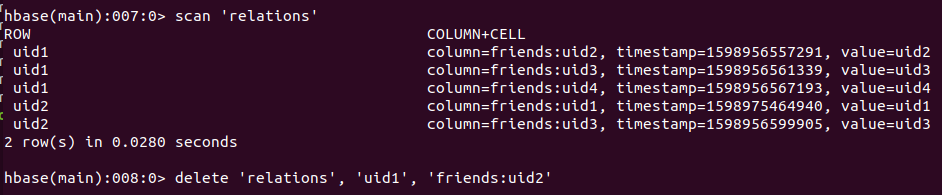

## 一、需求

需求: 

> 在社交网站，社交 APP 上会存储有大量的用户数据以及用户之间的关系数据。
> 比如： A用户的好友列表会展示出他所有的好友，现有一张 `Hbase` 表，存储就是当前注册用户的好友关系数据。

1. 使用 `Hbase` 相关 `API` 创建一张结构如上的表

2. 删除好友操作实现（好友关系双向，一方删除好友，另一方也会被迫删除好友）

>  例如：`uid1` 用户执行删除 `uid2` 这个好友，则 `uid2` 的好友列表中也必须删除 `uid1`


## 二、实现思路


```bash
# rowkey 为 用户Id
# friends 列族

rowkey      friends
uid1        uid2 uid3 uid4
uid2        uid1 uid3
```

1. 创建表 和 基本数据

```bash
# 版本为 1
$ create 'relations', {NAME => 'friends', VERSIONS => '1'}

# 插入记录 uid1 ：uid2 uid3 uid4
$ put 'relations', 'uid1', 'friends:uid2', 'uid2'
$ put 'relations', 'uid1', 'friends:uid3', 'uid3'
$ put 'relations', 'uid1', 'friends:uid4', 'uid4'

# 插入记录 uid2 ：uid1 uid3
$ put 'relations', 'uid2', 'friends:uid1', 'uid1'
$ put 'relations', 'uid2', 'friends:uid3', 'uid3'


hbase(main):015:0> scan 'relations'
ROW              COLUMN+CELL                                                                                                                             
 uid1            column=friends:uid2, timestamp=1598881670153, value=uid2
 uid1            column=friends:uid3, timestamp=1598881677381, value=uid3
 uid1            column=friends:uid4, timestamp=1598881683645, value=uid4
 uid2            column=friends:uid1, timestamp=1598881698725, value=uid1
 uid2            column=friends:uid3, timestamp=1598881690459, value=uid3
 2 row(s) in 0.0520 seconds
```

2. 编写 `Observer` 协处理器

> 通过 `Observer` 协处理器捕捉到 `relations` 删除数据时, 对应的 `rowkey`也删除。


3. 上传 `HDFS`

```bash
$ scp -P 22 hadoop-practice-1.0-SNAPSHOT.jar root@172.16.64.121:/root

$ mv hadoop-practice-1.0-SNAPSHOT.jar processor4.jar

[root@linux121 ~]# hadoop fs -mkdir /processor
[root@linux121 ~]# hadoop fs -put processor4.jar /processor
```

4. 挂载协处理器

```bash
$ alter 'relations',METHOD =>'table_att','Coprocessor'=>'hdfs://linux121:9000/processor/processor5.jar|com.donaldy.hbase.homework.DeleteRelationsProcessor|1001|'

$ desc 'relations'

hbase(main):024:0> desc 'relations'
Table relations is ENABLED                                                                                                                                                             
relations, {TABLE_ATTRIBUTES => {coprocessor$1 => 'hdfs://linux121:9000/processor/processor5.jar|com.donaldy.hbase.homework.DeleteRelationsProcessor|1001|'}                           
COLUMN FAMILIES DESCRIPTION                                                                                                                                                            
{NAME => 'friends', BLOOMFILTER => 'ROW', VERSIONS => '1', IN_MEMORY => 'false', KEEP_DELETED_CELLS => 'FALSE', DATA_BLOCK_ENCODING => 'NONE', TTL => 'FOREVER', COMPRESSION => 'NONE',
 MIN_VERSIONS => '0', BLOCKCACHE => 'true', BLOCKSIZE => '65536', REPLICATION_SCOPE => '0'}
1 row(s) in 0.0470 seconds
```

5. 执行删除操作

```bash
$ delete 'relations', 'uid1', 'friends:uid2'
```


## 三、实现代码

0. `API` 创建

```java
	@Test
    public void createTable() throws IOException {

        admin = (HBaseAdmin) conn.getAdmin();

        HTableDescriptor relations = new HTableDescriptor(TableName.valueOf("relations"));

        relations.addFamily(new HColumnDescriptor("friends"));

        admin.createTable(relations);
    }

	@Test
    public void putRelationData() throws IOException {

        Table table = conn.getTable(TableName.valueOf("relations"));

        List<Put> puts = new ArrayList<Put>();
        // rowkey  user1
        Put put = new Put(Bytes.toBytes("user1"));
        put.addColumn(Bytes.toBytes("friends"),Bytes.toBytes("user2"),Bytes.toBytes("user2"));
        put.addColumn(Bytes.toBytes("friends"),Bytes.toBytes("user3"),Bytes.toBytes("user3"));
        put.addColumn(Bytes.toBytes("friends"),Bytes.toBytes("user4"),Bytes.toBytes("user4"));
        puts.add(put);

        // rowkey user2
        Put put2 = new Put(Bytes.toBytes("user2"));
        put.addColumn(Bytes.toBytes("friends"),Bytes.toBytes("user1"),Bytes.toBytes("user1"));
        put.addColumn(Bytes.toBytes("friends"),Bytes.toBytes("user3"),Bytes.toBytes("user3"));
        puts.add(put2);

        table.put(puts);

        table.close();
    }
```

1. 协处理器

```java
package com.donaldy.hbase.homework;

import org.apache.hadoop.hbase.Cell;
import org.apache.hadoop.hbase.CellUtil;
import org.apache.hadoop.hbase.TableName;
import org.apache.hadoop.hbase.client.Delete;
import org.apache.hadoop.hbase.client.Durability;
import org.apache.hadoop.hbase.client.HTableInterface;
import org.apache.hadoop.hbase.coprocessor.BaseRegionObserver;
import org.apache.hadoop.hbase.coprocessor.ObserverContext;
import org.apache.hadoop.hbase.coprocessor.RegionCoprocessorEnvironment;
import org.apache.hadoop.hbase.regionserver.wal.WALEdit;
import org.apache.hadoop.hbase.util.Bytes;
import org.apache.hadoop.hbase.util.CollectionUtils;

import java.io.IOException;
import java.util.List;

/**
 * uid1 解除 uid2关系， uid2 同时 解除 uid1 关系
 *
 * uid1 ： currUser
 * uid2 ： otherUser
 *
 * @author donald
 * @date 2020/09/01
 */
public class DeleteRelationsProcessor extends BaseRegionObserver {

    @Override
    public void postDelete(ObserverContext<RegionCoprocessorEnvironment> e, Delete delete, WALEdit edit,
                           Durability durability) throws IOException {

        final HTableInterface relations = e.getEnvironment().getTable(TableName.valueOf("relations"));

        List<Cell> cells = delete.getFamilyCellMap().get(Bytes.toBytes("friends"));

        if (CollectionUtils.isEmpty(cells)) {

            relations.close();

            return;
        }

        // 获取 uid1 第一个 column
        Cell cell = cells.get(0);

        // 创建 uid2， 并设置需要删除的 column
        Delete otherUserDelete = new Delete(CellUtil.cloneQualifier(cell));
        otherUserDelete.addColumns(Bytes.toBytes("friends"), CellUtil.cloneRow(cell));

        relations.delete(otherUserDelete);

        // 关闭 table 对象
        relations.close();
    }
}
```


## 四、实验结果


```bash
hbase(main):026:0> scan 'relations'
ROW                                            COLUMN+CELL                                                                                                                             
 uid1                                          column=friends:uid2, timestamp=1598885427534, value=uid2                                                                                
 uid1                                          column=friends:uid3, timestamp=1598881677381, value=uid3                                                                                
 uid1                                          column=friends:uid4, timestamp=1598881683645, value=uid4                                                                                
 uid2                                          column=friends:uid1, timestamp=1598881698725, value=uid1                                                                                
 uid2                                          column=friends:uid3, timestamp=1598881690459, value=uid3                                                                                
2 row(s) in 0.0280 seconds


hbase(main):0027:0> scan 'relations'
ROW                                            COLUMN+CELL                                                                                                                            
 uid1                                          column=friends:uid3, timestamp=1598956561339, value=uid3                                                                               
 uid1                                          column=friends:uid4, timestamp=1598956567193, value=uid4                                                                               
 uid2                                          column=friends:uid3, timestamp=1598956599905, value=uid3                                                                               
2 row(s) in 0.1150 seconds

```

截图如下：



