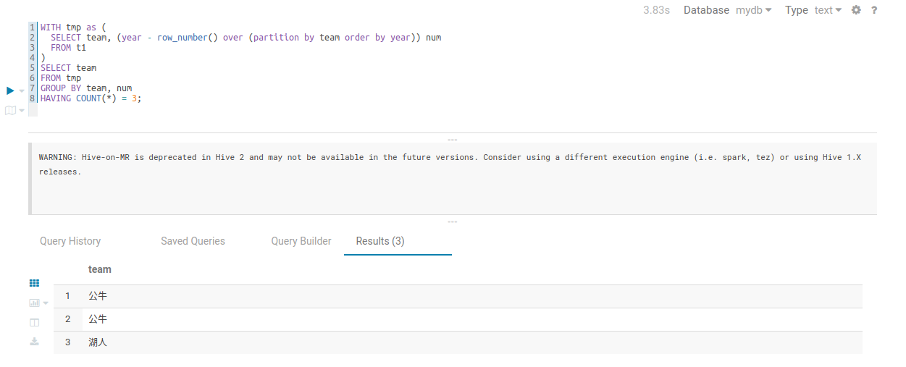

题目：找出全部夺得3连贯的队伍


数据集如下：
```text
team,year
活塞,1990
公牛,1991
公牛,1992
公牛,1993
火箭,1994
火箭,1995
公牛,1996
公牛,1997
公牛,1998
马刺,1999
湖人,2000
湖人,2001
湖人,2002
马刺,2003
活塞,2004
马刺,2005
热火,2006
马刺,2007
凯尔特人,2008
湖人,2009
湖人,2010

```


1. 创建表 和 导入数据
```sql
create table t1(
  team string,
  year int
)
row format delimited fields terminated by ',';
load data local inpath "/root/data/t1.dat" into table t1;
```


2. 思路

> 连续值查询问题。

思路如下：

- 使用 `row_number` 给组内编号
- 年份与 `row_number` 做差

```sql
-- 例如
湖人 2004 1
湖人 2005 2

-- 做差后
湖人 2003 1
湖人 2003 2


```
- 组合统计次数等于3的队伍


3. 实现：

```sql
-- 1. 编号
SELECT team, year, row_number() over (partition by team order by year) rownum
FROM t1;


-- 2. 做差
SELECT team, (year - row_number() over (partition by team order by year)) num
FROM t1;


-- 3. 组合 1 和 2，统计结果
WITH tmp as (
  SELECT team, (year - row_number() over (partition by team order by year)) num
  FROM t1
)
SELECT team
FROM tmp
GROUP BY team, num
HAVING COUNT(*) = 3;


-- 结果如下：
 	team
1	公牛
2	公牛
3	湖人
```


结果截图如图：

