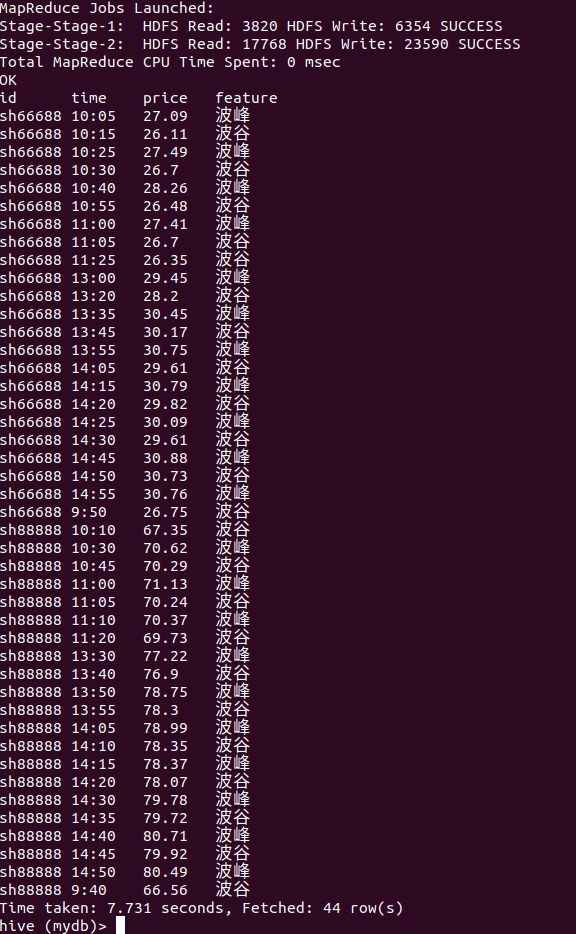

题目：找出每个 `id` 在一天之内所有的波峰与波谷值


数据集如下：
```sql
sh66688,9:35,29.48
sh66688,9:40,28.72
sh66688,9:45,27.74
sh66688,9:50,26.75
sh66688,9:55,27.13
sh66688,10:00,26.30
sh66688,10:05,27.09
sh66688,10:10,26.46
sh66688,10:15,26.11
sh66688,10:20,26.88
sh66688,10:25,27.49
sh66688,10:30,26.70
sh66688,10:35,27.57
sh66688,10:40,28.26
sh66688,10:45,28.03
sh66688,10:50,27.36
sh66688,10:55,26.48
sh66688,11:00,27.41
sh66688,11:05,26.70
sh66688,11:10,27.35
sh66688,11:15,27.35
sh66688,11:20,26.63
sh66688,11:25,26.35
sh66688,11:30,26.81
sh66688,13:00,29.45
sh66688,13:05,29.41
sh66688,13:10,29.10
sh66688,13:15,28.24
sh66688,13:20,28.20
sh66688,13:25,28.59
sh66688,13:30,29.49
sh66688,13:35,30.45
sh66688,13:40,30.31
sh66688,13:45,30.17
sh66688,13:50,30.55
sh66688,13:55,30.75
sh66688,14:00,30.03
sh66688,14:05,29.61
sh66688,14:10,29.96
sh66688,14:15,30.79
sh66688,14:20,29.82
sh66688,14:25,30.09
sh66688,14:30,29.61
sh66688,14:35,29.88
sh66688,14:40,30.36
sh66688,14:45,30.88
sh66688,14:50,30.73
sh66688,14:55,30.76
sh88888,9:35,67.23
sh88888,9:40,66.56
sh88888,9:45,66.73
sh88888,9:50,67.43
sh88888,9:55,67.49
sh88888,10:00,68.34
sh88888,10:05,68.13
sh88888,10:10,67.35
sh88888,10:15,68.13
sh88888,10:20,69.05
sh88888,10:25,69.82
sh88888,10:30,70.62
sh88888,10:35,70.59
sh88888,10:40,70.40
sh88888,10:45,70.29
sh88888,10:50,70.53
sh88888,10:55,70.92
sh88888,11:00,71.13
sh88888,11:05,70.24
sh88888,11:10,70.37
sh88888,11:15,69.79
sh88888,11:20,69.73
sh88888,11:25,70.52
sh88888,11:30,71.23
sh88888,13:00,72.85
sh88888,13:05,73.76
sh88888,13:10,74.72
sh88888,13:15,75.48
sh88888,13:20,75.80
sh88888,13:25,76.74
sh88888,13:30,77.22
sh88888,13:35,77.12
sh88888,13:40,76.90
sh88888,13:45,77.80
sh88888,13:50,78.75
sh88888,13:55,78.30
sh88888,14:00,78.68
sh88888,14:05,78.99
sh88888,14:10,78.35
sh88888,14:15,78.37
sh88888,14:20,78.07
sh88888,14:25,78.80
sh88888,14:30,79.78
sh88888,14:35,79.72
sh88888,14:40,80.71
sh88888,14:45,79.92
sh88888,14:50,80.49
sh88888,14:55,80.44
```


预期结果如下：
```sql
-- 最终结果与此类似：
id	time	price	feature
sh66688	10:05	27.09	波峰
sh66688	10:15	26.11	波谷
sh66688	10:25	27.49	波峰
sh66688	10:30	26.7	波谷
sh66688	10:40	28.26	波峰
sh66688	10:55	26.48	波谷
sh66688	11:00	27.41	波峰
sh66688	11:05	26.7	波谷
```


1. 创建表和导入数据
```sql
create table t2(
  id string,
  time string,
  price double
)row format delimited fields terminated by ',';

load data local inpath "/root/data/t2.dat" into table t2;
```


2. 思路

> 波峰：左升右降
> 波谷: 左降右升

- 按时间排序
- 当前行（`curr`）与上一行（`pre`）和下一行（`next`）比较

> 波峰：`curr` > `pre` , `curr` > `next`
> 波谷：`curr` < `pre` , `curr` < `next`


3. 实现

```sql
-- 1. 排序
SELECT id, time, price
FROM t2
ORDER BY id, time


-- 2. 比较
SELECT id, time, price as curr,
       lag(price) over(partition by id order by id, time) pre,
       lead(price) over(partition by id order by id, time) next
FROM t2
ORDER BY id, time


-- 3. 整合 1 和 2, 并标注上 feature
WITH tmp AS (
SELECT id, time, price, price as curr,
       lag(price) over(partition by id order by id, time) pre,
       lead(price) over(partition by id order by id, time) next
FROM t2
ORDER BY id, time
)
SELECT id, time, price,
CASE WHEN curr > pre AND curr > next THEN '波峰'
ELSE '波谷' END AS feature
FROM tmp
WHERE (curr > pre AND curr > next)
OR (curr < pre AND curr < next);


-- 结果如下：
OK
id	time	price	feature
sh66688	10:05	27.09	波峰
sh66688	10:15	26.11	波谷
sh66688	10:25	27.49	波峰
sh66688	10:30	26.7	波谷
sh66688	10:40	28.26	波峰
sh66688	10:55	26.48	波谷
sh66688	11:00	27.41	波峰
sh66688	11:05	26.7	波谷
sh66688	11:25	26.35	波谷
sh66688	13:00	29.45	波峰
sh66688	13:20	28.2	波谷
sh66688	13:35	30.45	波峰
sh66688	13:45	30.17	波谷
sh66688	13:55	30.75	波峰
sh66688	14:05	29.61	波谷
sh66688	14:15	30.79	波峰
sh66688	14:20	29.82	波谷
sh66688	14:25	30.09	波峰
sh66688	14:30	29.61	波谷
sh66688	14:45	30.88	波峰
sh66688	14:50	30.73	波谷
sh66688	14:55	30.76	波峰
sh66688	9:50	26.75	波谷
sh88888	10:10	67.35	波谷
sh88888	10:30	70.62	波峰
sh88888	10:45	70.29	波谷
sh88888	11:00	71.13	波峰
sh88888	11:05	70.24	波谷
sh88888	11:10	70.37	波峰
sh88888	11:20	69.73	波谷
sh88888	13:30	77.22	波峰
sh88888	13:40	76.9	波谷
sh88888	13:50	78.75	波峰
sh88888	13:55	78.3	波谷
sh88888	14:05	78.99	波峰
sh88888	14:10	78.35	波谷
sh88888	14:15	78.37	波峰
sh88888	14:20	78.07	波谷
sh88888	14:30	79.78	波峰
sh88888	14:35	79.72	波谷
sh88888	14:40	80.71	波峰
sh88888	14:45	79.92	波谷
sh88888	14:50	80.49	波峰
sh88888	9:40	66.56	波谷
```

Tips：包含中文，放在 `hue` 里执行会报错。


结果截图如下：



