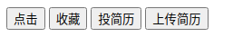
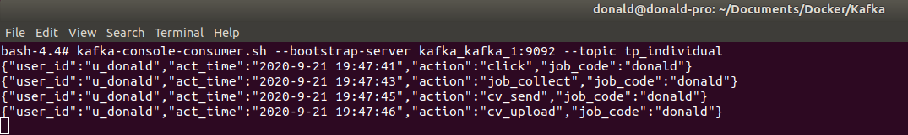

## 一、需求

> 使用 `Kafka` 做日志收集。
> 用户点击 `HTML`，`Nginx` 用于收集用户的点击数据流，记录日志 `access.log`，将 `Nginx` 收集的日志数据发送到 `Kafka` 主题：`tp_individual`
> Tips: 

需要收集的信息：

1. 用户ID（`user_id`）
2. 时间（`act_time`）
3. 操作（`action`，可以是：点击：`click`，收藏：`job_collect`，投简历：`cv_send`，上传简历：`cv_upload`）
4. 对方企业编码（`job_code`）


## 二、实现思路


实现思路如下：

1. 编写 `HTML`（有个4个`button`）
2. 配置 `Nginx`（基本配置和 `ngx_kafka_module`）

> - `nginx` 反向代理 `HTML`
> - 配置 `Nginx` 的 `access.log`

3. 配置 `Kafka`，创建 `Topic`（`docker`容器中）
4. 监听 `Topic`，查看消息


## 三、实现


实现步骤如下：


1. 编写 `HTMl`

```html
<!DOCTYPE html>
    <head>
        <meta http-equiv="Content-Type" content="text/html; charset=UTF-8">
        <meta name="viewport" content="width=device-width, initial-scale=1,shrink-to-fit=no">
        <title>index</title>
        <!-- jquery cdn, 可换其他 -->
        <script src="https://cdn.bootcdn.net/ajax/libs/jquery/3.5.1/jquery.js"></script>
    </head>
    <body>
        <input id="click" type="button" value="点击" onclick="operate('click')" />
        <input id="collect" type="button" value="收藏" onclick="operate('job_collect')" />
        <input id="send" type="button" value="投简历" onclick="operate('cv_send')" />
        <input id="upload" type="button" value="上传简历" onclick="operate('cv_upload')" />
    </body>

    <script>

        function operate(action) {

            var json = {'user_id': 'u_donald', 'act_time': current().toString(), 'action': action, 'job_code': 'donald'};

            $.ajax({
                url:"http://172.16.64.21:8880/kafka/log",
                type:"POST" ,
                crossDomain: true,
                data: JSON.stringify(json),
                // 下面这句话允许跨域的cookie访问
                xhrFields: {
                    withCredentials: true
                },
                success:function (data, status, xhr) {

                    // console.log("操作成功：'" + action)
                },
                error:function (err) {

                    // console.log(err.responseText);
                }
            });
        };

        function current() {
            var d   = new Date(),
                str = '';
            str += d.getFullYear() + '-';
            str += d.getMonth() + 1 + '-';
            str += d.getDate() + ' ';
            str += d.getHours() + ':';
            str += d.getMinutes() + ':';
            str += d.getSeconds();
            return str;
        }
    </script>

</html>
```


2. 配置 `nginx`

```bash
# 1. 安装git
$ yum install -y git

# 2. 安装相关依赖
$ yum install -y gcc gcc-c++ zlib zlib-devel openssl openssl-devel pcre pcre-devel

# 3. kafka的客户端源码
$ cd /root/software
$ git clone https://github.com/edenhill/librdkafka

# 4. 编译
$ cd /root/software/librdkafka 
$ ./configure
$ make && make install

# 5. 安装
$ cd /root/software
$ wget http://nginx.org/download/nginx-1.18.0.tar.gz

# 6. 解压
$ tar -zxf nginx-1.18.0.tar.gz

# 7. 下载模块源码
$ cd /root/software
$ git clone https://github.com/brg-liuwei/ngx_kafka_module

# 8. 编译
$ cd /root/software/nginx-1.18.0
$ ./configure --add-module=/root/software/ngx_kafka_module/
$ make && make install
```

修改 `nginx.conf` 配置

```bash
# 1. 修改 nginx.conf 配置
$ vi /usr/local/nginx/conf/nginx.conf

# 启动 nginx
$ cd /usr/local/nginx/sbin
$ ./nginx 
```

`nginx.conf` 如下

```conf
#pid        logs/nginx.pid;


events {
    worker_connections  1024;
}


http {
    include       mime.types;
    default_type  application/octet-stream;

    #log_format  main  '$remote_addr - $remote_user [$time_local] "$request" '
    #                  '$status $body_bytes_sent "$http_referer" '
    #                  '"$http_user_agent" "$http_x_forwarded_for"';

    #access_log  logs/access.log  main;

    sendfile        on;
    #tcp_nopush     on;

    #keepalive_timeout  0;
    keepalive_timeout  65;

    #gzip  on;

    kafka;
    kafka_broker_list 192.168.226.36:9092;

    server {
        listen       8880;
        server_name  172.16.64.21;

        #charset koi8-r;

        #access_log  logs/host.access.log  main;

        location /kafka/log {
            kafka_topic tp_individual; 
        }

        #error_page  404              /404.html;
    }

}
```


3. 创建 `kafka` 的 `topic`

`kafka` 配置 `docker-compose.yml`

```yml
version: '2.1'
services:
  zookeeper:
    image: wurstmeister/zookeeper
    ports:
      - "2181"
  kafka:
    image: wurstmeister/kafka
    ports:
      - "9092:9092"
    environment:
      KAFKA_ADVERTISED_HOST_NAME: 192.168.226.36
      KAFKA_ZOOKEEPER_CONNECT: zookeeper:2181
    volumes:
      - /var/run/docker.sock:/var/run/docker.sock
```

启动

```bash
# 启动 kafka 和 zk 容器
$ sudo docker-compose up -d

$ donald@donald-pro:~/Documents/Docker/Kafka$ sudo docker-compose up -d

# 创建 `topic` ： tp_individual
# 进入 kafka 容器创建
$ sudo docker exec -it 0240 /bin/bash
$ kafka-topics.sh --zookeeper kafka_zookeeper_1:2181 --create --topic tp_individual --partitions 1 --replication-factor 1

# 启动消费者
$ kafka-console-consumer.sh --bootstrap-server kafka_kafka_1:9092 --topic tp_individual --from-beginning
```

测试：

```bash
donald@donald-pro:~$ curl 172.16.64.21:8880/kafka/log -d "test message" -v

# 在 kafka 消费端，可以监听到消息
```


4. 监听 `kafka` 的 `topic`，查看消息

```bash
bash-4.4# kafka-console-consumer.sh --bootstrap-server kafka_kafka_1:9092 --topic tp_individual
{"user_id":"u_donald","act_time":"2020-9-21 19:47:41","action":"click","job_code":"donald"}
{"user_id":"u_donald","act_time":"2020-9-21 19:47:43","action":"job_collect","job_code":"donald"}
{"user_id":"u_donald","act_time":"2020-9-21 19:47:45","action":"cv_send","job_code":"donald"}
{"user_id":"u_donald","act_time":"2020-9-21 19:47:46","action":"cv_upload","job_code":"donald"}

```

`html`，如图：




`kafka`，如图：




