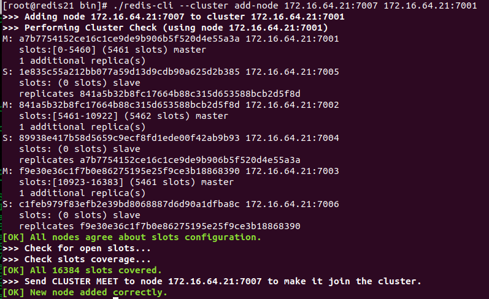
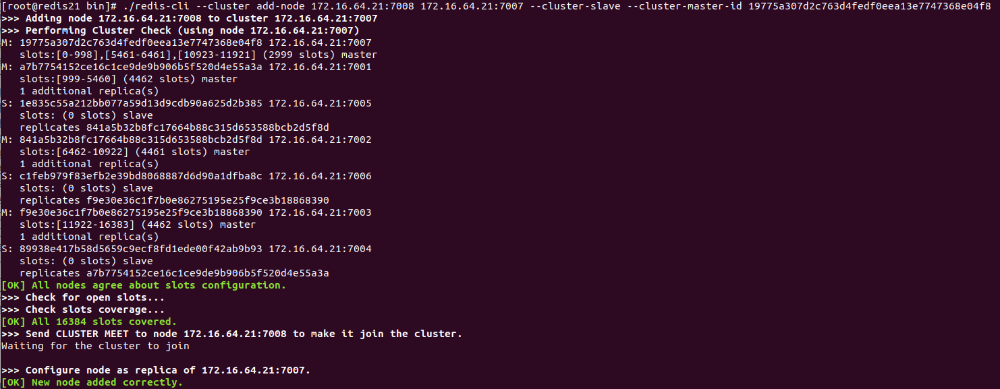
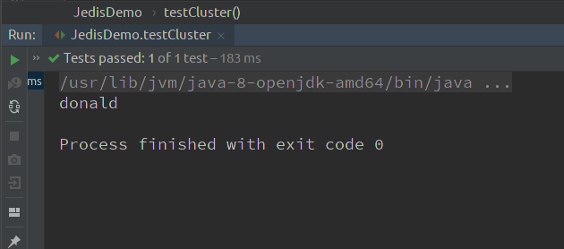

## 一、需求

需求如下：

1. 搭建 `Redis 5.0` 集群，要求三主三从
2. 添加一主一从（`Master4` 和 `Slave4`）
3. 通过 `JedisCluster` 向 `RedisCluster` 添加数据和取出数据


## 二、思路


思路如下：

1. 搭建集群（三主三从）
2. 另起2个服务（7007 和 7008）
3. 写 `JedisCluster` 访问集群


## 三、实现步骤


实现步骤，主要为三步：

- 搭建集群（三主三从）
- 动态添加一主一从（`Master4` 和 `Slave4`）
- 写 `JedisCluster` 访问集群


### （1） 搭建集群（三主三从）

#### 1）`Redis` 安装

1. 安装 `C` 语言需要的 `GCC` 环境

```bash
yum install -y gcc-c++
yum install -y wget
```

2. 下载并解压缩 `Redis` 源码压缩包

```bash
cd /
wget http://download.redis.io/releases/redis-5.0.5.tar.gz
tar -zxf redis-5.0.5.tar.gz
```


3. 编译 `Redis` 源码, 进入 `redis-5.0.5` 目录,执行编译命令

```bash
cd redis-5.0.5/src
make
```


4. 安装 `Redis`, 需要通过 `PREFIX` 指定安装路径

```bash
mkdir /usr/redis -p
make install PREFIX=/usr/redis
```


#### 2）搭建集群

> 伪分布式搭建

0. 预备操作：

```bash
# RedisCluster 最少需要三台主服务器, 三台从服务器。

# 端口号分别为:7001~7006

mkdir /var/redis-cluster/7001 -p

# 去安装的目录下
cd /redis-5.0.5/src

make install PREFIX=/var/redis-cluster/7001

操作如下：
[root@redis21 src]# pwd
/redis-5.0.5/src
[root@redis21 src]# make install PREFIX=/var/redis-cluster/7001
    CC Makefile.dep

Hint: It's a good idea to run 'make test' ;)

    INSTALL install
    INSTALL install
    INSTALL install
    INSTALL install
    INSTALL install
```

1. 创建 7001 实例，拷贝并编辑 `redis.conf` 

```bash
[root@redis21 bin]# pwd
/var/redis-cluster/7001/bin
[root@redis21 bin]# cp /redis-5.0.5/redis.conf /var/redis-cluster/7001/bin/

vi redis.conf

# 将`daemonize`由`no`改为`yes`
daemonize yes

# 默认绑定的是回环地址,默认不能被其他机器访问
# bind 127.0.0.1

# 是否开启保护模式,由yes该为no
protected-mode no

# 修改端口
port 7001

# 打开 cluster-enable yes
```

2. 复制 7001， 创建 7002 ～ 7006 实例

> 注意修改端口

```bash
[root@redis21 redis-cluster]# pwd
/var/redis-cluster
[root@redis21 redis-cluster]# cp -r 7001 7002
[root@redis21 redis-cluster]# cp -r 7001 7003
[root@redis21 redis-cluster]# cp -r 7001 7004
[root@redis21 redis-cluster]# cp -r 7001 7005
[root@redis21 redis-cluster]# cp -r 7001 7006

# 修改每个端口
# 步骤省略
[root@redis21 redis-cluster]# vi 7002/bin/redis.conf 
```

3. 创建 `start.sh`，并赋权，然后启动所有的实例

> 赋权：`chmod u+x start.sh`

```bash
vi start.sh

cd 7001/bin
./redis-server redis.conf
cd ..
cd ..
cd 7002/bin
./redis-server redis.conf
cd ..
cd ..
cd 7003/bin
./redis-server redis.conf
cd ..
cd ..
cd 7004/bin
./redis-server redis.conf
cd ..
cd ..
cd 7005/bin
./redis-server redis.conf
cd ..
cd ..
cd 7006/bin
./redis-server redis.conf
cd ..
cd ..
```

```bash
[root@redis21 redis-cluster]# chmod u+x start.sh
[root@redis21 redis-cluster]# ./start.sh 
13613:C 08 Sep 2020 16:22:27.430 # oO0OoO0OoO0Oo Redis is starting oO0OoO0OoO0Oo
13613:C 08 Sep 2020 16:22:27.430 # Redis version=5.0.5, bits=64, commit=00000000, modified=0, pid=13613, just started
13613:C 08 Sep 2020 16:22:27.430 # Configuration loaded
13615:C 08 Sep 2020 16:22:27.453 # oO0OoO0OoO0Oo Redis is starting oO0OoO0OoO0Oo
13615:C 08 Sep 2020 16:22:27.453 # Redis version=5.0.5, bits=64, commit=00000000, modified=0, pid=13615, just started
13615:C 08 Sep 2020 16:22:27.453 # Configuration loaded
13634:C 08 Sep 2020 16:26:00.058 # oO0OoO0OoO0Oo Redis is starting oO0OoO0OoO0Oo
13634:C 08 Sep 2020 16:26:00.058 # Redis version=5.0.5, bits=64, commit=00000000, modified=0, pid=13634, just started
13634:C 08 Sep 2020 16:26:00.058 # Configuration loaded
13636:C 08 Sep 2020 16:26:00.083 # oO0OoO0OoO0Oo Redis is starting oO0OoO0OoO0Oo
13636:C 08 Sep 2020 16:26:00.083 # Redis version=5.0.5, bits=64, commit=00000000, modified=0, pid=13636, just started
13636:C 08 Sep 2020 16:26:00.083 # Configuration loaded
13641:C 08 Sep 2020 16:26:00.106 # oO0OoO0OoO0Oo Redis is starting oO0OoO0OoO0Oo
13641:C 08 Sep 2020 16:26:00.107 # Redis version=5.0.5, bits=64, commit=00000000, modified=0, pid=13641, just started
13641:C 08 Sep 2020 16:26:00.107 # Configuration loaded
13646:C 08 Sep 2020 16:26:00.128 # oO0OoO0OoO0Oo Redis is starting oO0OoO0OoO0Oo
13646:C 08 Sep 2020 16:26:00.128 # Redis version=5.0.5, bits=64, commit=00000000, modified=0, pid=13646, just started
13646:C 08 Sep 2020 16:26:00.128 # Configuration loaded
```


4. 创建 `Redis` 集群(创建时 `Redis` 里不要有数据)

```bash
# cluster-replicas : 1 1从机 前三个为主
# 采用机器 ip 而不采用 127.0.0.1 不然外界无法访问

[root@redis21 bin]# pwd
/var/redis-cluster/7001/bin
[root@redis21 bin]# ./redis-cli --cluster create 172.16.64.21:7001 172.16.64.21:7002 172.16.64.21:7003 172.16.64.21:7004 172.16.64.21:7005 172.16.64.21:7006 --cluster-replicas 1
>>> Performing hash slots allocation on 6 nodes...
Master[0] -> Slots 0 - 5460
Master[1] -> Slots 5461 - 10922
Master[2] -> Slots 10923 - 16383
Adding replica 172.16.64.21:7005 to 172.16.64.21:7001
Adding replica 172.16.64.21:7006 to 172.16.64.21:7002
Adding replica 172.16.64.21:7004 to 172.16.64.21:7003
>>> Trying to optimize slaves allocation for anti-affinity
[WARNING] Some slaves are in the same host as their master
M: a7b7754152ce16c1ce9de9b906b5f520d4e55a3a 172.16.64.21:7001
   slots:[0-5460] (5461 slots) master
M: 841a5b32b8fc17664b88c315d653588bcb2d5f8d 172.16.64.21:7002
   slots:[5461-10922] (5462 slots) master
M: f9e30e36c1f7b0e86275195e25f9ce3b18868390 172.16.64.21:7003
   slots:[10923-16383] (5461 slots) master
S: 89938e417b58d5659c9ecf8fd1ede00f42ab9b93 172.16.64.21:7004
   replicates a7b7754152ce16c1ce9de9b906b5f520d4e55a3a
S: 1e835c55a212bb077a59d13d9cdb90a625d2b385 172.16.64.21:7005
   replicates 841a5b32b8fc17664b88c315d653588bcb2d5f8d
S: c1feb979f83efb2e39bd8068887d6d90a1dfba8c 172.16.64.21:7006
   replicates f9e30e36c1f7b0e86275195e25f9ce3b18868390
Can I set the above configuration? (type 'yes' to accept): yes
>>> Nodes configuration updated
>>> Assign a different config epoch to each node
>>> Sending CLUSTER MEET messages to join the cluster
Waiting for the cluster to join
.....
>>> Performing Cluster Check (using node 172.16.64.21:7001)
M: a7b7754152ce16c1ce9de9b906b5f520d4e55a3a 172.16.64.21:7001
   slots:[0-5460] (5461 slots) master
   1 additional replica(s)
S: 1e835c55a212bb077a59d13d9cdb90a625d2b385 172.16.64.21:7005
   slots: (0 slots) slave
   replicates 841a5b32b8fc17664b88c315d653588bcb2d5f8d
M: 841a5b32b8fc17664b88c315d653588bcb2d5f8d 172.16.64.21:7002
   slots:[5461-10922] (5462 slots) master
   1 additional replica(s)
S: 89938e417b58d5659c9ecf8fd1ede00f42ab9b93 172.16.64.21:7004
   slots: (0 slots) slave
   replicates a7b7754152ce16c1ce9de9b906b5f520d4e55a3a
M: f9e30e36c1f7b0e86275195e25f9ce3b18868390 172.16.64.21:7003
   slots:[10923-16383] (5461 slots) master
   1 additional replica(s)
S: c1feb979f83efb2e39bd8068887d6d90a1dfba8c 172.16.64.21:7006
   slots: (0 slots) slave
   replicates f9e30e36c1f7b0e86275195e25f9ce3b18868390
[OK] All nodes agree about slots configuration.
>>> Check for open slots...
>>> Check slots coverage...
[OK] All 16384 slots covered.
```


5. 查看 `slot` 分配情况

```bash
[root@redis21 bin]# pwd
/var/redis-cluster/7001/bin
[root@redis21 bin]# cat nodes.conf 
1e835c55a212bb077a59d13d9cdb90a625d2b385 172.16.64.21:7005@17005 slave 841a5b32b8fc17664b88c315d653588bcb2d5f8d 0 1599554111100 5 connected
a7b7754152ce16c1ce9de9b906b5f520d4e55a3a 172.16.64.21:7001@17001 myself,master - 0 1599554112000 1 connected 0-5460
841a5b32b8fc17664b88c315d653588bcb2d5f8d 172.16.64.21:7002@17002 master - 0 1599554112105 2 connected 5461-10922
89938e417b58d5659c9ecf8fd1ede00f42ab9b93 172.16.64.21:7004@17004 slave a7b7754152ce16c1ce9de9b906b5f520d4e55a3a 0 1599554114115 4 connected
f9e30e36c1f7b0e86275195e25f9ce3b18868390 172.16.64.21:7003@17003 master - 0 1599554113113 3 connected 10923-16383
c1feb979f83efb2e39bd8068887d6d90a1dfba8c 172.16.64.21:7006@17006 slave f9e30e36c1f7b0e86275195e25f9ce3b18868390 0 1599554113000 6 connected
vars currentEpoch 6 lastVoteEpoch 0
```


6. 命令客户端连接集群

```bash
# 任意节点连接
# 注意:-c 表示是以 redis 集群方式进行连接
./redis-cli -h 127.0.0.1 -p 7001 -c

[root@redis21 bin]# ./redis-cli -h 127.0.0.1 -p 7001 -c
127.0.0.1:7001> set name:1 donald
-> Redirected to slot [12501] located at 172.16.64.21:7003
OK
172.16.64.21:7003> set name:2 donaldy
-> Redirected to slot [182] located at 172.16.64.21:7001
OK
```

7. 查看集群的命令

```bash
# 查看集群状态
cluster info

# 查看集群中的节点
cluster nodes

172.16.64.21:7001> cluster info
cluster_state:ok
cluster_slots_assigned:16384
cluster_slots_ok:16384
cluster_slots_pfail:0
cluster_slots_fail:0
cluster_known_nodes:6
cluster_size:3
cluster_current_epoch:6
cluster_my_epoch:1
cluster_stats_messages_ping_sent:403
cluster_stats_messages_pong_sent:380
cluster_stats_messages_sent:783
cluster_stats_messages_ping_received:375
cluster_stats_messages_pong_received:403
cluster_stats_messages_meet_received:5
cluster_stats_messages_received:783

172.16.64.21:7001> cluster nodes
1e835c55a212bb077a59d13d9cdb90a625d2b385 172.16.64.21:7005@17005 slave 841a5b32b8fc17664b88c315d653588bcb2d5f8d 0 1599554526460 5 connected
a7b7754152ce16c1ce9de9b906b5f520d4e55a3a 172.16.64.21:7001@17001 myself,master - 0 1599554526000 1 connected 0-5460
841a5b32b8fc17664b88c315d653588bcb2d5f8d 172.16.64.21:7002@17002 master - 0 1599554528470 2 connected 5461-10922
89938e417b58d5659c9ecf8fd1ede00f42ab9b93 172.16.64.21:7004@17004 slave a7b7754152ce16c1ce9de9b906b5f520d4e55a3a 0 1599554528000 4 connected
f9e30e36c1f7b0e86275195e25f9ce3b18868390 172.16.64.21:7003@17003 master - 0 1599554528000 3 connected 10923-16383
c1feb979f83efb2e39bd8068887d6d90a1dfba8c 172.16.64.21:7006@17006 slave f9e30e36c1f7b0e86275195e25f9ce3b18868390 0 1599554529476 6 connecte
```


### （2）动态添加一主一从（`7007` 和 `7008`）

#### 1） 添加主节点

1. 添加主节点

> 先创建7007节点 (无数据)

```bash
# 1. 创建目录
[root@redis21 redis-cluster]# pwd
/var/redis-cluster

$ mkdir 7007


# 2. install
[root@redis21 src]# pwd
/redis-5.0.5/src

$ make install PREFIX=/var/redis-cluster/7007

[root@redis21 src]# make install PREFIX=/var/redis-cluster/7007

Hint: It's a good idea to run 'make test' ;)

    INSTALL install
    INSTALL install
    INSTALL install
    INSTALL install
    INSTALL install
    
    
# 3. 复制配置文件
[root@redis21 bin]# cp /redis-5.0.5/redis.conf /var/redis-cluster/7007/bin/
[root@redis21 bin]# ll
total 32800
-rwxr-xr-x. 1 root root 4366536 Sep  9 07:46 redis-benchmark
-rwxr-xr-x. 1 root root 8111784 Sep  9 07:46 redis-check-aof
-rwxr-xr-x. 1 root root 8111784 Sep  9 07:46 redis-check-rdb
-rwxr-xr-x. 1 root root 4806752 Sep  9 07:46 redis-cli
-rw-r--r--. 1 root root   61797 Sep  9 07:48 redis.conf
lrwxrwxrwx. 1 root root      12 Sep  9 07:46 redis-sentinel -> redis-server
-rwxr-xr-x. 1 root root 8111784 Sep  9 07:46 redis-server

# 4. 更新 redis.conf
# 修改跟之前一样，这边省略

# 5. 复制7007为7008, 为了之后的从节点
[root@redis21 redis-cluster]# cp -r 7007 7008
# 同时修改端口
[root@redis21 redis-cluster]# vi 7008/bin/redis.conf 
```

2. 启动 7007

```bash
[root@redis21 redis-cluster]# cd 7007/bin/
[root@redis21 bin]# ./redis-server redis.conf 
13892:C 09 Sep 2020 07:56:00.340 # oO0OoO0OoO0Oo Redis is starting oO0OoO0OoO0Oo
13892:C 09 Sep 2020 07:56:00.340 # Redis version=5.0.5, bits=64, commit=00000000, modified=0, pid=13892, just started
13892:C 09 Sep 2020 07:56:00.340 # Configuration loaded
```


3. 添加7007结点作为新节点, 并启动

```bash
[root@redis21 bin]# pwd
/var/redis-cluster/7001/bin
[root@redis21 bin]# ./redis-cli --cluster add-node 172.16.64.21:7007 172.16.64.21:7001
>>> Adding node 172.16.64.21:7007 to cluster 172.16.64.21:7001
>>> Performing Cluster Check (using node 172.16.64.21:7001)
M: a7b7754152ce16c1ce9de9b906b5f520d4e55a3a 172.16.64.21:7001
   slots:[0-5460] (5461 slots) master
   1 additional replica(s)
S: 1e835c55a212bb077a59d13d9cdb90a625d2b385 172.16.64.21:7005
   slots: (0 slots) slave
   replicates 841a5b32b8fc17664b88c315d653588bcb2d5f8d
M: 841a5b32b8fc17664b88c315d653588bcb2d5f8d 172.16.64.21:7002
   slots:[5461-10922] (5462 slots) master
   1 additional replica(s)
S: 89938e417b58d5659c9ecf8fd1ede00f42ab9b93 172.16.64.21:7004
   slots: (0 slots) slave
   replicates a7b7754152ce16c1ce9de9b906b5f520d4e55a3a
M: f9e30e36c1f7b0e86275195e25f9ce3b18868390 172.16.64.21:7003
   slots:[10923-16383] (5461 slots) master
   1 additional replica(s)
S: c1feb979f83efb2e39bd8068887d6d90a1dfba8c 172.16.64.21:7006
   slots: (0 slots) slave
   replicates f9e30e36c1f7b0e86275195e25f9ce3b18868390
[OK] All nodes agree about slots configuration.
>>> Check for open slots...
>>> Check slots coverage...
[OK] All 16384 slots covered.
>>> Send CLUSTER MEET to node 172.16.64.21:7007 to make it join the cluster.
[OK] New node added correctly.
```


4. 查看集群结点发现7007已添加到集群中

> 目前7007还没有槽

```bash
[root@redis21 bin]# pwd
/var/redis-cluster/7001/bin
[root@redis21 bin]# ./redis-cli -p 7001 -c
127.0.0.1:7001> cluster nodes
1e835c55a212bb077a59d13d9cdb90a625d2b385 172.16.64.21:7005@17005 slave 841a5b32b8fc17664b88c315d653588bcb2d5f8d 0 1599609612952 5 connected
a7b7754152ce16c1ce9de9b906b5f520d4e55a3a 172.16.64.21:7001@17001 myself,master - 0 1599609610000 1 connected 0-5460
841a5b32b8fc17664b88c315d653588bcb2d5f8d 172.16.64.21:7002@17002 master - 0 1599609611000 2 connected 5461-10922
19775a307d2c763d4fedf0eea13e7747368e04f8 172.16.64.21:7007@17007 master - 0 1599609611000 0 connected
89938e417b58d5659c9ecf8fd1ede00f42ab9b93 172.16.64.21:7004@17004 slave a7b7754152ce16c1ce9de9b906b5f520d4e55a3a 0 1599609613955 4 connected
f9e30e36c1f7b0e86275195e25f9ce3b18868390 172.16.64.21:7003@17003 master - 0 1599609613000 3 connected 10923-16383
c1feb979f83efb2e39bd8068887d6d90a1dfba8c 172.16.64.21:7006@17006 slave f9e30e36c1f7b0e86275195e25f9ce3b18868390 0 1599609611940 6 connected
```

5. 给刚添加的7007结点分配槽

> 添加完主节点需要对主节点进行 `hash` 槽分配, 这样该主节才可以存储数据。

```bash
[root@redis21 bin]# pwd
/var/redis-cluster/7001/bin
[root@redis21 bin]# ./redis-cli --cluster reshard 172.16.64.21:7007
>>> Performing Cluster Check (using node 172.16.64.21:7007)
M: 19775a307d2c763d4fedf0eea13e7747368e04f8 172.16.64.21:7007
   slots: (0 slots) master
M: a7b7754152ce16c1ce9de9b906b5f520d4e55a3a 172.16.64.21:7001
   slots:[0-5460] (5461 slots) master
   1 additional replica(s)
S: 1e835c55a212bb077a59d13d9cdb90a625d2b385 172.16.64.21:7005
   slots: (0 slots) slave
   replicates 841a5b32b8fc17664b88c315d653588bcb2d5f8d
M: 841a5b32b8fc17664b88c315d653588bcb2d5f8d 172.16.64.21:7002
   slots:[5461-10922] (5462 slots) master
   1 additional replica(s)
S: c1feb979f83efb2e39bd8068887d6d90a1dfba8c 172.16.64.21:7006
   slots: (0 slots) slave
   replicates f9e30e36c1f7b0e86275195e25f9ce3b18868390
M: f9e30e36c1f7b0e86275195e25f9ce3b18868390 172.16.64.21:7003
   slots:[10923-16383] (5461 slots) master
   1 additional replica(s)
S: 89938e417b58d5659c9ecf8fd1ede00f42ab9b93 172.16.64.21:7004
   slots: (0 slots) slave
   replicates a7b7754152ce16c1ce9de9b906b5f520d4e55a3a
[OK] All nodes agree about slots configuration.
>>> Check for open slots...
>>> Check slots coverage...
[OK] All 16384 slots covered.
```

执行上面命令过程中，需要输入如下：

- 5.1. 输入要分配的数量

> 这样输入了 3000

```bash
How many slots do you want to move (from 1 to 16384)? 3000
```

- 5.2. 输入接收槽的结点id

> `19775a307d2c763d4fedf0eea13e7747368e04f8` 是 7007 的节点id，从上面复制。
> 也可以从 `cluster nodes` 中查看

```bash
What is the receiving node ID? 19775a307d2c763d4fedf0eea13e7747368e04f8
```

- 5.3. 输入源结点id

> 这里，选择 `all`，即从所有节点从拿取 3000 个节点
> 也可以指定某个特定的节点

```bash
Please enter all the source node IDs.
  Type 'all' to use all the nodes as source nodes for the hash slots.
  Type 'done' once you entered all the source nodes IDs.
Source node #1: all
```


- 5.4 输入 `yes` 开始移动槽到目标结点 `id`

```bash
Do you want to proceed with the proposed reshard plan (yes/no)? yes
```

6. 查看结果

```bash
[root@redis21 bin]# ./redis-cli -p 7001 -c
127.0.0.1:7001> cluster nodes
1e835c55a212bb077a59d13d9cdb90a625d2b385 172.16.64.21:7005@17005 slave 841a5b32b8fc17664b88c315d653588bcb2d5f8d 0 1599609886113 5 connected
a7b7754152ce16c1ce9de9b906b5f520d4e55a3a 172.16.64.21:7001@17001 myself,master - 0 1599609886000 1 connected 999-5460
841a5b32b8fc17664b88c315d653588bcb2d5f8d 172.16.64.21:7002@17002 master - 0 1599609884000 2 connected 6462-10922
19775a307d2c763d4fedf0eea13e7747368e04f8 172.16.64.21:7007@17007 master - 0 1599609889126 7 connected 0-998 5461-6461 10923-11921
89938e417b58d5659c9ecf8fd1ede00f42ab9b93 172.16.64.21:7004@17004 slave a7b7754152ce16c1ce9de9b906b5f520d4e55a3a 0 1599609888124 4 connected
f9e30e36c1f7b0e86275195e25f9ce3b18868390 172.16.64.21:7003@17003 master - 0 1599609888000 3 connected 11922-16383
c1feb979f83efb2e39bd8068887d6d90a1dfba8c 172.16.64.21:7006@17006 slave f9e30e36c1f7b0e86275195e25f9ce3b18868390 0 1599609887116 6 connected
```




#### 2）添加从节点

> 7008 节点是 （1）中就准备了。

1. 先启动 7008

```bash
[root@redis21 bin]# pwd
/var/redis-cluster/7008/bin
[root@redis21 bin]# ./redis-server redis.conf 
13930:C 09 Sep 2020 08:28:04.576 # oO0OoO0OoO0Oo Redis is starting oO0OoO0OoO0Oo
13930:C 09 Sep 2020 08:28:04.576 # Redis version=5.0.5, bits=64, commit=00000000, modified=0, pid=13930, just started
13930:C 09 Sep 2020 08:28:04.576 # Configuration loaded
```


2. 添加从节点

> 添加7008从结点, 将7008作为7007的从结点

```bash
[root@redis21 bin]# pwd
/var/redis-cluster/7001/bin
[root@redis21 bin]# ./redis-cli --cluster add-node 172.16.64.21:7008 172.16.64.21:7007 --cluster-slave --cluster-master-id 19775a307d2c763d4fedf0eea13e7747368e04f8
>>> Adding node 172.16.64.21:7008 to cluster 172.16.64.21:7007
>>> Performing Cluster Check (using node 172.16.64.21:7007)
M: 19775a307d2c763d4fedf0eea13e7747368e04f8 172.16.64.21:7007
   slots:[0-998],[5461-6461],[10923-11921] (2999 slots) master
M: a7b7754152ce16c1ce9de9b906b5f520d4e55a3a 172.16.64.21:7001
   slots:[999-5460] (4462 slots) master
   1 additional replica(s)
S: 1e835c55a212bb077a59d13d9cdb90a625d2b385 172.16.64.21:7005
   slots: (0 slots) slave
   replicates 841a5b32b8fc17664b88c315d653588bcb2d5f8d
M: 841a5b32b8fc17664b88c315d653588bcb2d5f8d 172.16.64.21:7002
   slots:[6462-10922] (4461 slots) master
   1 additional replica(s)
S: c1feb979f83efb2e39bd8068887d6d90a1dfba8c 172.16.64.21:7006
   slots: (0 slots) slave
   replicates f9e30e36c1f7b0e86275195e25f9ce3b18868390
M: f9e30e36c1f7b0e86275195e25f9ce3b18868390 172.16.64.21:7003
   slots:[11922-16383] (4462 slots) master
   1 additional replica(s)
S: 89938e417b58d5659c9ecf8fd1ede00f42ab9b93 172.16.64.21:7004
   slots: (0 slots) slave
   replicates a7b7754152ce16c1ce9de9b906b5f520d4e55a3a
[OK] All nodes agree about slots configuration.
>>> Check for open slots...
>>> Check slots coverage...
[OK] All 16384 slots covered.
>>> Send CLUSTER MEET to node 172.16.64.21:7008 to make it join the cluster.
Waiting for the cluster to join

>>> Configure node as replica of 172.16.64.21:7007.
[OK] New node added correctly.
```


3. 查看节点信息

```bash
[root@redis21 bin]# cat nodes.conf 
c5832d0d49123a9f41e1ab89b4ae011eef298086 172.16.64.21:7008@17008 slave 19775a307d2c763d4fedf0eea13e7747368e04f8 0 1599611562555 7 connected
1e835c55a212bb077a59d13d9cdb90a625d2b385 172.16.64.21:7005@17005 slave 841a5b32b8fc17664b88c315d653588bcb2d5f8d 0 1599611562000 5 connected
a7b7754152ce16c1ce9de9b906b5f520d4e55a3a 172.16.64.21:7001@17001 myself,master - 0 1599611559000 1 connected 999-5460
841a5b32b8fc17664b88c315d653588bcb2d5f8d 172.16.64.21:7002@17002 master - 0 1599611562754 2 connected 6462-10922
19775a307d2c763d4fedf0eea13e7747368e04f8 172.16.64.21:7007@17007 master - 0 1599611563000 7 connected 0-998 5461-6461 10923-11921
89938e417b58d5659c9ecf8fd1ede00f42ab9b93 172.16.64.21:7004@17004 slave a7b7754152ce16c1ce9de9b906b5f520d4e55a3a 0 1599611563759 4 connected
f9e30e36c1f7b0e86275195e25f9ce3b18868390 172.16.64.21:7003@17003 master - 0 1599611562000 3 connected 11922-16383
c1feb979f83efb2e39bd8068887d6d90a1dfba8c 172.16.64.21:7006@17006 slave f9e30e36c1f7b0e86275195e25f9ce3b18868390 0 1599611562000 6 connected
vars currentEpoch 7 lastVoteEpoch 0
```




### （3）写 `JedisCluster` 访问集群

```java
package com.donaldy.redis.demo;

import org.junit.Test;
import redis.clients.jedis.HostAndPort;
import redis.clients.jedis.Jedis;
import redis.clients.jedis.JedisCluster;
import redis.clients.jedis.JedisPoolConfig;

import java.util.HashSet;
import java.util.Set;

/**
 * @author donald
 * @date 2020/09/09
 */
public class JedisDemo {

    @Test
    public void testCluster() {

        JedisPoolConfig config = new JedisPoolConfig();

        Set<HostAndPort> jedisClusterNode = new HashSet<>();
        jedisClusterNode.add(new HostAndPort("172.16.64.21", 7001));
        jedisClusterNode.add(new HostAndPort("172.16.64.21", 7002));
        jedisClusterNode.add(new HostAndPort("172.16.64.21", 7003));
        jedisClusterNode.add(new HostAndPort("172.16.64.21", 7004));
        jedisClusterNode.add(new HostAndPort("172.16.64.21", 7005));
        jedisClusterNode.add(new HostAndPort("172.16.64.21", 7006));
        JedisCluster jcd = new JedisCluster(jedisClusterNode, config);
        jcd.set("name:001","donald");

        String value = jcd.get("name:001");

        System.out.println(value);
    }
}
```

结果如下：

```text
donald
```

截图如下：




