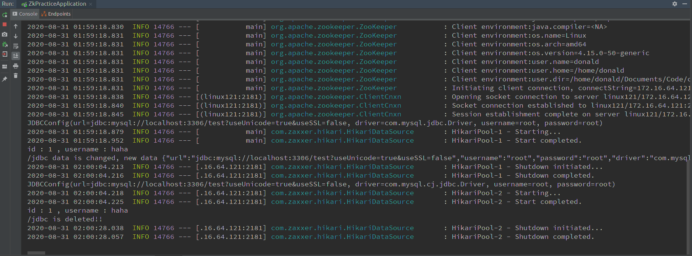

基于 `Zookeeper` 实现简易版配置中心


## 一、需求


1. 创建一个Web项目，将数据库连接信息交给Zookeeper配置中心管理

> 即：当项目Web项目启动时，从 `Zookeeper` 进行 `MySQL` 配置参数的拉取


2. 要求项目通过数据库连接池访问MySQL（连接池可以自由选择熟悉的）


3. 当 `Zookeeper` 配置信息变化后 `Web` 项目自动感知，正确释放之前连接池，创建新的连接池


## 二、实现思路

总体思路:

1. 启动 `SpringBoot` 项目

> 启动时，从 `Zookeeper` 拉取配置

2. 获取配置，创建对应的数据库连接池，访问 `MySQL`

> 读取 `zk` 中数据，序列化为字符串，再将字符串用 `jackson` 转为对象
> 创建 `HikariPool`，访问数据库

3. 注册监听 `Zookeeper` 对应节点数据变化，释放连接池 或 创建新的连接池

> 类似重复 2. 的过程


## 三、实现代码

0. 数据库中配置

```sql
-- mysql 版本 8.0

mysql> desc user;
+----------|-------------|------|-----|---------|-------+
| Field    | Type        | Null | Key | Default | Extra |
+----------|-------------|------|-----|---------|-------+
| id       | int(11)     | NO   | PRI | NULL    |       |
| username | varchar(64) | NO   |     |         |       |
+----------|-------------|------|-----|---------|-------+
2 rows in set (0.01 sec)

mysql> insert into user(id, username) values (1, "haha");
Query OK, 1 row affected (0.01 sec)
```


1. `maven` 配置

```xml
    <dependencies>
        <dependency>
            <groupId>org.springframework.boot</groupId>
            <artifactId>spring-boot-starter-web</artifactId>
        </dependency>

        <dependency>
            <groupId>org.projectlombok</groupId>
            <artifactId>lombok</artifactId>
            <optional>true</optional>
        </dependency>
        <dependency>
            <groupId>org.springframework.boot</groupId>
            <artifactId>spring-boot-starter-test</artifactId>
            <scope>test</scope>
            <exclusions>
                <exclusion>
                    <groupId>org.junit.vintage</groupId>
                    <artifactId>junit-vintage-engine</artifactId>
                </exclusion>
            </exclusions>
        </dependency>

        <dependency>
            <groupId>com.zaxxer</groupId>
            <artifactId>HikariCP</artifactId>
            <version>3.4.5</version>
            <scope>compile</scope>
        </dependency>

        <dependency>
            <groupId>mysql</groupId>
            <artifactId>mysql-connector-java</artifactId>
            <version>8.0.11</version>
        </dependency>

        <!-- zookeeper -->
        <dependency>
            <groupId>org.apache.zookeeper</groupId>
            <artifactId>zookeeper</artifactId>
            <version>3.4.14</version>
        </dependency>
        <dependency>
            <groupId>com.101tec</groupId>
            <artifactId>zkclient</artifactId>
            <version>0.2</version>
        </dependency>

    </dependencies>
```


2. `Spring Boot` 代码

```java
package com.donaldy.zkpractice;

import com.fasterxml.jackson.core.JsonProcessingException;
import com.fasterxml.jackson.databind.ObjectMapper;
import com.zaxxer.hikari.HikariConfig;
import com.zaxxer.hikari.HikariDataSource;
import lombok.Data;
import lombok.ToString;
import org.I0Itec.zkclient.IZkDataListener;
import org.I0Itec.zkclient.ZkClient;
import org.I0Itec.zkclient.exception.ZkMarshallingError;
import org.I0Itec.zkclient.serialize.ZkSerializer;
import org.springframework.boot.SpringApplication;
import org.springframework.boot.autoconfigure.SpringBootApplication;

import java.sql.Connection;
import java.sql.PreparedStatement;
import java.sql.ResultSet;
import java.sql.SQLException;

@SpringBootApplication
public class Application {

    private static HikariDataSource hikariDataSource;

    private static ZkClient zkClient;

    private static ObjectMapper mapper = new ObjectMapper();

    /**
     * 启动服务
     * 
     * 1. 启动 web 容器
     * 2. 初始化 zookeeper
     * 3. 配置数据库连接池
     * 
     * @param args 参数
     */
    public static void main(String[] args) {

        SpringApplication.run(Application.class, args);

        initZk();

        configHikariSource();
    }

    private static void initZk() {

        zkClient = new ZkClient("172.16.64.121:2181");

        zkClient.setZkSerializer(new ZkStrSerializer());

        zkClient.subscribeDataChanges("/jdbc", new IZkDataListener() {

            public void handleDataChange(String path, Object data) {

                System.out.println(path + " data is changed, new data " + data);

                hikariDataSource.close();

                configHikariSource();
            }

            public void handleDataDeleted(String path) {

                System.out.println(path + " is deleted!!");

                hikariDataSource.close();
            }
        });
    }

    /**
     * 配置数据库连接池
     * 
     * 1. 从 zookeeper 中获取配置信息
     * 2. 更新 hikari 配置
     * 3. 执行测试 sql
     */
    private static void configHikariSource(){

        JDBCConfig myConfig = getJDBCConfig();

        updateHikariConfig(myConfig);

        try {

            executeTestSQL();
        } catch (SQLException e) {
            e.printStackTrace();
        }
    }

    private static void executeTestSQL() throws SQLException {
        
        Connection connection = hikariDataSource.getConnection();

        PreparedStatement pst = connection.prepareStatement( "SELECT id, username FROM user;" );

        ResultSet rs = pst.executeQuery();

        while (rs.next()) {

            System.out.println("id : " + rs.getString(1) + " , username : " + rs.getString(2));
        }
    }

    private static void updateHikariConfig(JDBCConfig myConfig) {

        HikariConfig config = new HikariConfig();
        config.setJdbcUrl(myConfig.getUrl());
        config.setUsername(myConfig.getUsername());
        config.setPassword(myConfig.getPassword());
        config.addDataSourceProperty( "driverClassName" , myConfig.getDriver());
        config.addDataSourceProperty( "cachePrepStmts" , "true" );
        config.addDataSourceProperty( "prepStmtCacheSize" , "250" );
        config.addDataSourceProperty( "prepStmtCacheSqlLimit" , "2048" );
        hikariDataSource = new HikariDataSource(config);
    }

    private static JDBCConfig getJDBCConfig() {

        Object data = zkClient.readData("/jdbc");

        try {
            JDBCConfig myConfig = mapper.readValue(data.toString(), JDBCConfig.class);

            System.out.println(myConfig.toString());
            
            return myConfig;
            
        } catch (JsonProcessingException e) {
            
            return new JDBCConfig();
        }
    }
}

class ZkStrSerializer implements ZkSerializer {

    @Override
    public byte[] serialize(Object o) throws ZkMarshallingError {
        return String.valueOf(o).getBytes();
    }

    @Override
    public Object deserialize(byte[] bytes) throws ZkMarshallingError {
        return new String(bytes);
    }
}

@Data
@ToString
class JDBCConfig {

    private String url;

    private String driver = "com.mysql.jdbc.Driver";

    private String username;

    private String password;
}
```


## 四、运行结果

运行行为如下：

1. 在 `zk` 中创建节点

```bash
create /jdbc {"url":"jdbc:mysql://localhost:3306/test?useUnicode=true&useSSL=false","username":"root","password":"root","driver":"com.mysql.jdbc.Driver"}
```

2. 更改节点中的数据

```bash
# 驱动：改变为 com.mysql.cj.jdbc.Driver
# 因为 mysql 版本使用 8.0

set /jdbc {"url":"jdbc:mysql://localhost:3306/test?useUnicode=true&useSSL=false","username":"root","password":"root","driver":"com.mysql.cj.jdbc.Driver"}
```

3. 删除数据

```bash
delete /jdbc
```


运行结果为：

```text
2020-08-31 01:59:18.845  INFO 14766 --- [(linux121:2181)] org.apache.zookeeper.ClientCnxn          : Session establishment complete on server linux121/172.16.64.121:2181, sessionid = 0x100217325960011, negotiated timeout = 30000
JDBCConfig(url=jdbc:mysql://localhost:3306/test?useUnicode=true&useSSL=false, driver=com.mysql.jdbc.Driver, username=root, password=root)
2020-08-31 01:59:18.879  INFO 14766 --- [           main] com.zaxxer.hikari.HikariDataSource       : HikariPool-1 - Starting...
2020-08-31 01:59:18.952  INFO 14766 --- [           main] com.zaxxer.hikari.HikariDataSource       : HikariPool-1 - Start completed.
id : 1 , username : haha
/jdbc data is changed, new data {"url":"jdbc:mysql://localhost:3306/test?useUnicode=true&useSSL=false","username":"root","password":"root","driver":"com.mysql.cj.jdbc.Driver"}
2020-08-31 02:00:04.213  INFO 14766 --- [.16.64.121:2181] com.zaxxer.hikari.HikariDataSource       : HikariPool-1 - Shutdown initiated...
2020-08-31 02:00:04.216  INFO 14766 --- [.16.64.121:2181] com.zaxxer.hikari.HikariDataSource       : HikariPool-1 - Shutdown completed.
JDBCConfig(url=jdbc:mysql://localhost:3306/test?useUnicode=true&useSSL=false, driver=com.mysql.cj.jdbc.Driver, username=root, password=root)
2020-08-31 02:00:04.218  INFO 14766 --- [.16.64.121:2181] com.zaxxer.hikari.HikariDataSource       : HikariPool-2 - Starting...
2020-08-31 02:00:04.225  INFO 14766 --- [.16.64.121:2181] com.zaxxer.hikari.HikariDataSource       : HikariPool-2 - Start completed.
id : 1 , username : haha
/jdbc is deleted!!
2020-08-31 02:00:28.038  INFO 14766 --- [.16.64.121:2181] com.zaxxer.hikari.HikariDataSource       : HikariPool-2 - Shutdown initiated...
2020-08-31 02:00:28.057  INFO 14766 --- [.16.64.121:2181] com.zaxxer.hikari.HikariDataSource       : HikariPool-2 - Shutdown completed.
```

运行截图如下：

